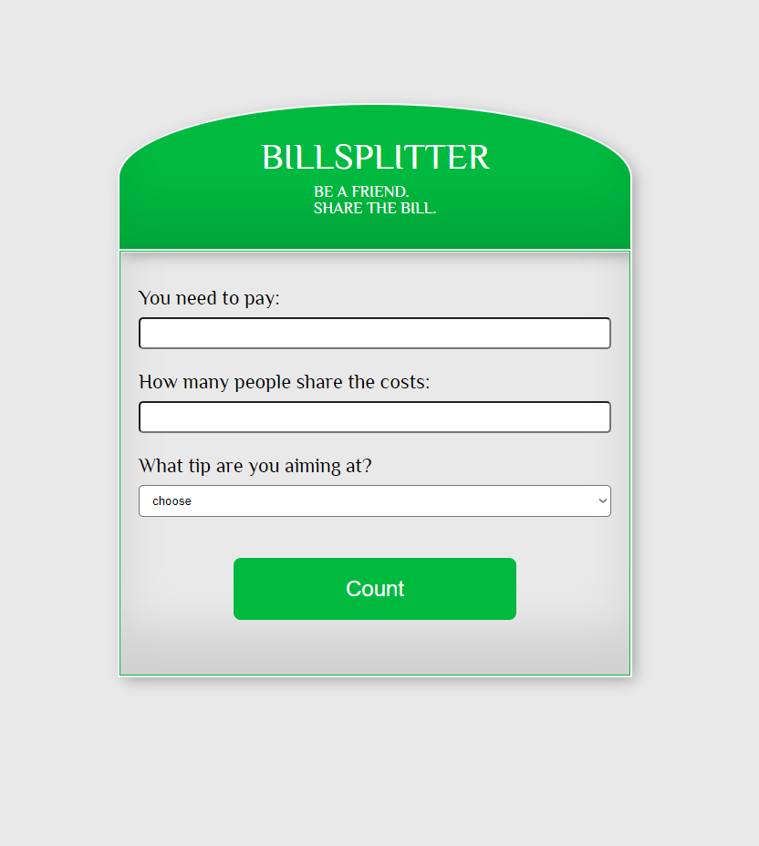
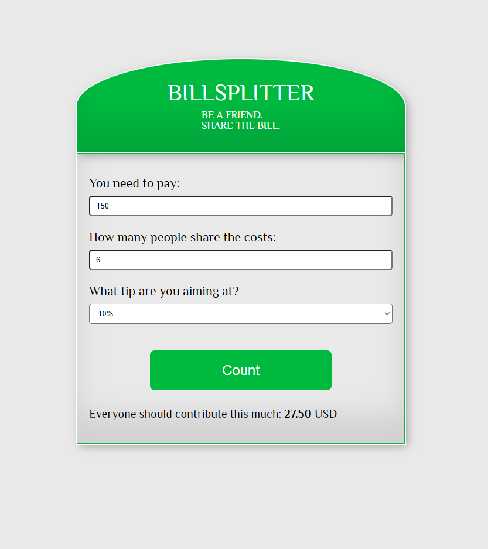

# **BillsTipsCalculator**

#### Have you ever ran into a problem of having to share a bill with your friends? What if on top of that you wanted to leave a tip? How are you going to count all of it? The Bill Splitter App is here to help! 

🔎 The website has been deployed and can be visited here:
_[Bill Splitter](https://billsplitter-eight.vercel.app)_.

---

## **_Built with_**

1. [Vite](https://vitejs.dev/guide/)
2. [JavaScript](https://developer.mozilla.org/en-US/docs/Web/javascript)
3. [SCSS](https://sass-lang.com/install)

## **_There are only 2 simple installation steps._**

1. **Install Vite Build Tool**

```bash
npm create vite@latest
```

2. **Install SASS preprocessor**

```bash
npm install -g sass
```

---

### 🖥️ **_Screenshots_**

### Overall view



### A view with data and calculation results



---

### 👉 **_Contibution_**

#### Everyone with a desire to contribute or develop this project is more than welcome to do so.

### 🏷️ **_Credits_**

#### Though some things have been adjusted or coded differently, this project has been inspired by one of the projects created by Mateusz Maj, and it will be only fair to acknowledge that.
